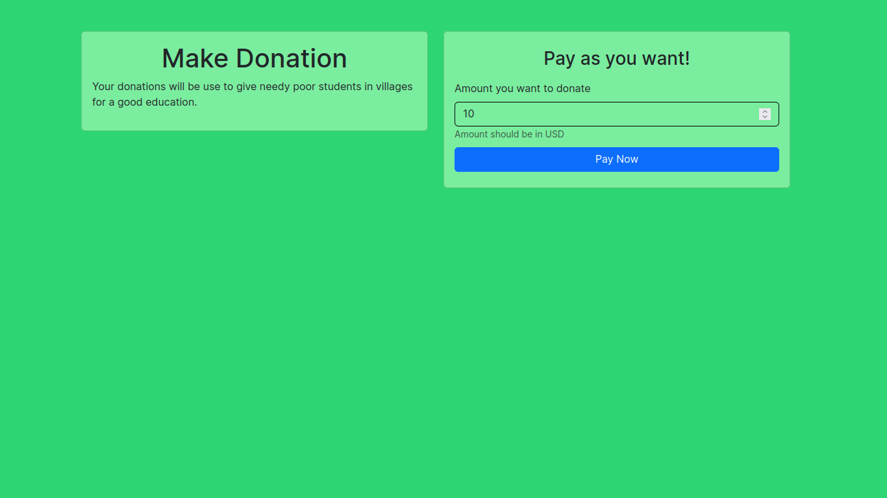
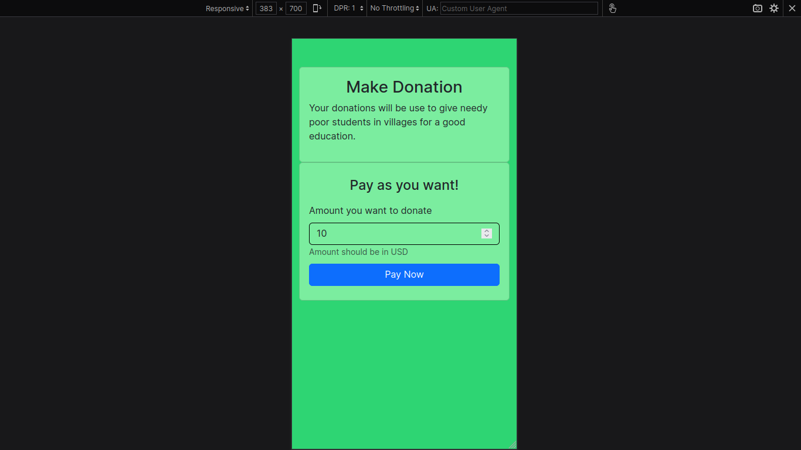
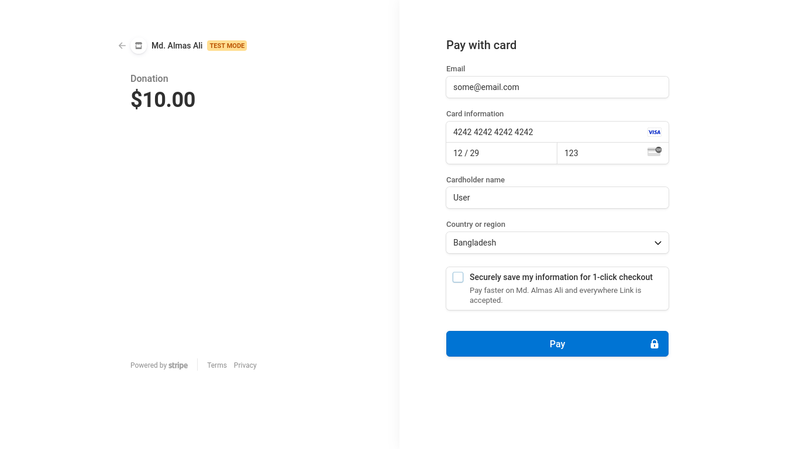
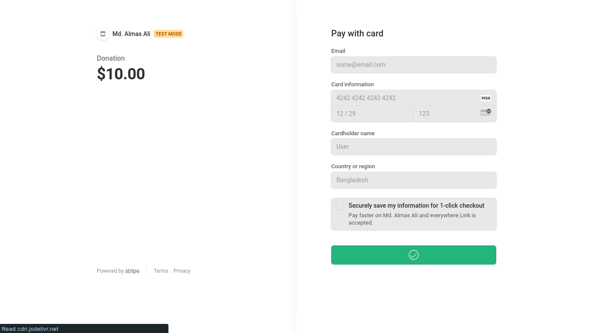

# Stripe + Django integration

Payment gateway integration testing. This is just a demo donation collection application for collecting donations annonymously.

No informations needed. Just pay and go...

Author [@Almas-Ali](https://github.com/Almas-Ali)
Repository [stripe-django-donation](https://github.com/Almas-Ali/stripe-django-donation)

## Installation

Straightforward installation steps.

```bash
# Clone the repository
git clone https://github.com/Almas-Ali/stripe-django-donation.git

# Change the directory
cd stripe-django-donation

# Create a virtual environment
python3 -m venv venv

# Activate the virtual environment (Linux)
source venv/bin/activate

# Activate the virtual environment (Windows)
venv\Scripts\activate

# Install the requirements
pip install -r requirements.txt
```

Create a `.env` file in the root directory. Follow the `.env.example` file for the environment variables.

You can't use payment handling in the development mode. You need to run the server with SSL certificate to use the payment handling. You can use `ngrok` to create a secure tunnel to your localhost.

First, install `ngrok` from [here](https://ngrok.com/download).

Then, run the following command to create a secure tunnel to your localhost.

```bash
# Run the server
python manage.py runserver

# Create a secure tunnel to your localhost
ngrok http 8000
```

Now, you can use the secure tunnel URL to test the payment handling.

## Screenshots

### Index page



### Index responsive



### Payment page



### Payment success



### Redirect back to the website


## License

This project is licensed under the MIT License - see the [LICENSE](LICENSE) file for details.
